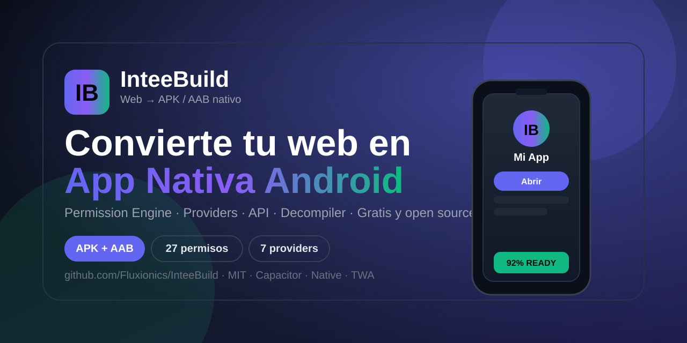

# InteeBuild — Web a App Nativa Android

Convierte cualquier sitio web o código HTML en una aplicación nativa de Android (APK y AAB). Permission Engine con 68 permisos granulares reales (runtime + Settings + manifest verificados), 2 motores WebView listos (Capacitor, Native), API para developers, decompiler con código fuente y compilación en la nube con GitHub Actions.

**Studio:** `index.html` · **Developer API:** `developer.html` · **Docs:** [Inicio rápido](./docs/quickstart.md) · [Solución de problemas](./docs/troubleshooting.md) · [Guía de permisos](./docs/permissions.md) · [Producción](./docs/production.md)


## Caracteristicas

- **Entrada flexible:** URL pública o código HTML directo.
- **Permission Engine:** 68 permisos granulares (GPS preciso / segundo plano two-step, Bluetooth Scan / Connect / Advertise, alarmas Schedule / Use, storage multimedia API 33, splits finos de cámara, contactos, SMS y teléfono). Solo se genera lo seleccionado: batch runtime data-driven, accesos especiales por Settings, `uses-feature` y filtro NFC. Audit por evidencia (GENERATED vs SPEC ONLY) y Build Readiness que bloquea builds rotos.
- **Providers WebView:** Capacitor 7 (READY), Native WebView ligero (READY). TWA, GeckoView y Cordova (EXPERIMENTAL). Flutter / Tauri (PLANNED).
- **Icono e icono adaptativo:** PNG, JPG y WebP, generación de `mipmap-anydpi-v26` con fondo y foreground.
- **Apariencia:** tema claro, oscuro o sistema, color de acento, status bar y navigation bar, edge-to-edge, splash screen con color y duración, animación de entrada y orientación. Drawer lateral, bottom tabs, pull-to-refresh, offline screen, loading y FLAG_SECURE.
- **Analizador web:** HTTPS, viewport móvil, manifest, favicon, theme-color, service worker, recursos inseguros, CSP, eval, errores HTML, optimización y PWA. Puntuación 0-100 con auto-fix.
- **Plantillas:** Web, PWA, Radio, Tienda, Blog, Juego, Educación, Empresa, Comunidad, Streaming, Dashboard, AI, Maps, Finanzas y Eventos.
- **Plugins nativos:** cámara, geolocalización, compartir, archivos, haptics, clipboard, notificaciones push y locales, biometría, Bluetooth LE, NFC y puente InteeBridge.
- **Salida:** APK instalable, AAB para Play Store o ambos, proyecto ZIP, firma con keystore propio y ofuscación ProGuard.
- **Decompiler:** sube un APK y recupera package, permisos, manifest preview y ZIP con código fuente + config re-importable.
- **API developers:** `POST /api/v1/build` con `X-API-Key` (hash sha256, scopes, revocación), `GET /api/docs`, panel en `developer.html`.
- **Compilación:** workflow en 7 pasos con logs en vivo y descarga directa sin pasar por GitHub.
- **Historial y estadísticas:** últimos 30 builds con estado, tiempo y enlaces.

## Requisitos

- Node.js 18 o superior
- Cuenta de GitHub y un repositorio vacio para los builds

## Instalacion local

```bash
git clone https://github.com/Fluxionics/InteeBuild.git
cd InteeBuild
npm install
cp .env.example .env
```

Edita `.env`:

```
GITHUB_TOKEN=ghp_xxxxxxxxxxxxxxxxxxxx
INTEE_BUILDS_REPO=tu-usuario/inteebuild-builds
```

Crea el repositorio `inteebuild-builds` vacio en GitHub y genera un token clasico con permisos `repo` y `workflow`.

Inicia el servidor:

```bash
npm run dev
```

Abre `http://localhost:8787`.

## Despliegue en Render

1. Haz fork o sube este repositorio a tu cuenta de GitHub.
2. En Render crea un nuevo Web Service conectado al repositorio.
3. Configura las variables de entorno `GITHUB_TOKEN` y `INTEE_BUILDS_REPO`.
4. Render detecta `render.yaml` y despliega automaticamente.

Cualquier usuario puede clonar el proyecto y ejecutarlo localmente sin necesidad de Render.

## Uso

1. Elige una plantilla o configura manualmente.
2. Ingresa la URL o pega tu HTML y usa Analizar para ver la puntuacion y recomendaciones. Aplica el Autopilot si lo deseas.
3. Personaliza nombre, paquete, version, icono y colores.
4. Selecciona permisos y plugins nativos.
5. Ajusta SDK, orientacion, pantalla, deep links y notificaciones. Sube tu keystore si necesitas firma release.
6. Revisa el Preview, compila y descarga el APK, AAB o ZIP. El historial queda disponible en el ultimo paso.

## Audio en segundo plano

Para que el audio continue con la pantalla apagada activa Foreground Service y Wake Lock. El AndroidManifest declara `FOREGROUND_SERVICE_MEDIA_PLAYBACK` y un servicio `dataSync|mediaPlayback`. Tu pagina debe mantener el elemento `<audio>` sin pausarlo en `visibilitychange`.

## Seguridad

- Bloqueo de `localhost` y redes privadas (`127.`, `10.`, `192.168.`, `172.16-31.`, `169.254.`, metadata endpoints).
- Validacion de redirecciones y limite de tamano de HTML e iconos.
- CORS configurable con `CORS_ORIGIN` y limite de 10 builds por hora por IP.

## API

- `GET /api/health` — estado del servidor
- `GET /api/analyze?url=` — análisis web
- `POST /api/analyze/html` — análisis de HTML directo
- `POST /api/build` — iniciar compilación
- `POST /api/v1/build` — compilación con API Key (`X-API-Key` o `Authorization: Bearer`)
- `GET /api/build/:id` — estado del build
- `GET /api/permissions/spec` — catálogo de permisos granulares
- `POST /api/permissions/audit` — audit Manifest + Runtime + Native + Bridge
- `POST /api/permissions/suggest` — sugerencia desde Web APIs detectadas
- `POST /api/build-readiness` — readiness 0-100 con checks
- `POST /api/decompile` — decompila APK y devuelve código fuente en ZIP
- `GET /api/keys` — gestión de API Keys (hash, scopes, revocación)
- `GET /api/download/:id` — descarga directa del APK
- `GET /api/download/:id/aab` — descarga directa del AAB
- `POST /api/project` — descarga del proyecto ZIP
- `GET /api/history` — últimos builds
- `GET /api/stats` — estadísticas

## Estructura

```
InteeBuild/
  index.html
  css/style.css
  js/app.js
  js/inteebridge.js
  server/
    server.js
    github.js
    templates.js
    generator/
      index.js (config + proyectos)
      permissions.js (spec 68 permisos)
      manifest.js (manifest + features + NFC)
      runtime.js (runtime + special access)
      audio.js (radio/audio nativo)
      providers.js (WebView + catálogo)
      workflow.js (GitHub Actions)
      audit.js (audit + readiness)
      signing.js (iOS)
      versions.js (SDKs + plugins)
  assets/icon.svg
  render.yaml
  package.json
```

## Licencia

MIT. Consulta el archivo LICENSE o la pagina de Licencia en la web para mas detalles.

## Soporte

Abre un issue en GitHub si encuentras un problema con algun toggle, permiso o compilacion. Incluye los logs del build y la configuracion usada.
