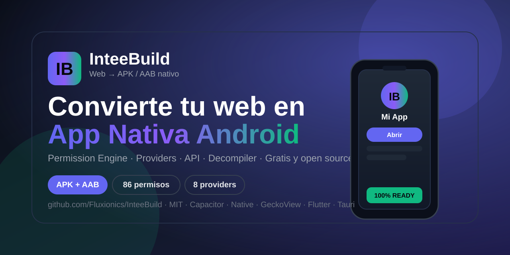
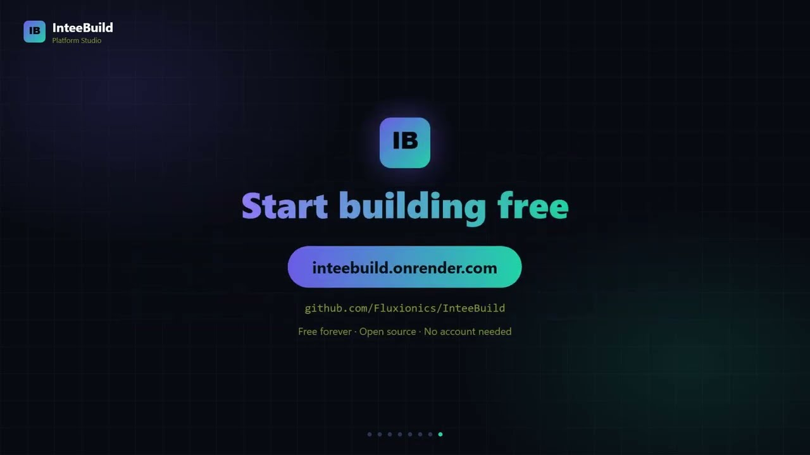
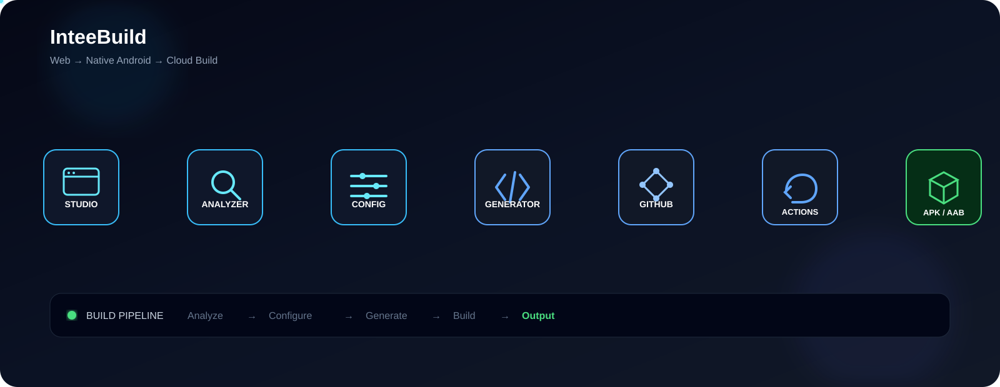

# InteeBuild

InteeBuild es una aplicación web que convierte una URL o un archivo HTML en una app Android instalable. El estudio (`index.html`) arma la configuración en el navegador, el servidor Node (`server/`) genera el proyecto Android y lo sube a un repositorio de GitHub, y GitHub Actions compila. No hay servidores de compilación propios ni cuentas de usuario: fuera de tu máquina, todo pasa en tu repo de GitHub.

Versión 4.2.0, licencia MIT.

<div align="center">
  <a href="https://youtu.be/O1bPuUUDzHs">
    
  </a>
</div>

## How InteeBuild Works

<div align="center">
  <a href="https://github.com/Fluxionics/InteeBuild">
    
  </a>
</div>

InteeBuild transforms web content into native Android projects and uses GitHub Actions to compile the final APK or AAB.

### Core Pipeline

```text
Web Content
    │
    ▼
Analyzer
    │
    ▼
Configuration
    │
    ├── Permissions
    ├── Plugins
    ├── Providers
    ├── Templates
    └── Settings
    │
    ▼
Permission Audit
    │
    ▼
Project Generator
    │
    ├── AndroidManifest.xml
    ├── Native Runtime
    ├── WebView / Provider
    ├── Assets
    ├── Gradle
    └── GitHub Workflow
    │
    ▼
GitHub API
    │
    ▼
GitHub Actions
    │
    ▼
Gradle
    │
    ├──────────────┐
    ▼              ▼
   APK            AAB
    │              │
    └──────┬───────┘
           ▼
       Artifacts
           │
           ▼
   Download / QR / History
```

### Main Components

| Component | Responsibility |
| --- | --- |
| Studio | Project configuration and build control |
| Web Analyzer | Analyzes URLs and web content |
| Permission Engine | Manages Android permissions |
| Permission Audit | Validates generated permissions |
| Generator | Creates the Android project |
| Providers | Define the application runtime |
| Plugins | Add native capabilities |
| Templates | Provide predefined project structures |
| GitHub API | Creates and manages build projects |
| GitHub Actions | Performs cloud compilation |
| Gradle | Compiles the Android application |
| Artifacts | Stores generated APK/AAB files |
| InteeBuild API | Handles downloads, QR codes and build history |

### Build Flow

```text
Analyze → Configure → Audit → Generate → GitHub → Actions → Gradle → APK/AAB
```

## Qué compila y qué no

Las salidas binarias son **APK y AAB**, nada más. El campo `outputType` acepta `apk`, `aab` o `both`, y el workflow sólo tiene pasos de Gradle para esas dos salidas.

Cada proyecto trae además el código fuente en el ZIP (`POST /api/project`), con carpetas extra según lo que actives:

- `desktop/`: proyecto Electron (`package.json`, `main.js`, README con `npm run build`). El selector "Desktop .EXE/.APP" del estudio sólo escribe esa carpeta. **No hay ningún paso de CI que produzca `.exe`, `.dmg`, `.msi` ni `.AppImage`**, y el campo `desktopPlatform` se valida pero no lo usa ni el generador ni el workflow.
- `twa-manifest.json` y `assetlinks.json`: material para publicar una Trusted Web Activity con tus propias herramientas (bubblewrap). InteeBuild no la compila.
- `flutter/` o `tauri/`: esqueleto de proyecto si eliges esos providers. Tampoco compilan en la CI.
- `www/manifest.webmanifest` y `www/sw.js`: PWA instalable, activada por defecto (`pwaEnabled: false` la desactiva).

iOS es el otro caso que conviene tener claro. Con `platform: ios` o `both` el workflow lanza un job `ios-check` en `macos-latest`. **Sólo si subes el `.p12`, el `.mobileprovision` y la contraseña** (paso "Firma iOS") corre el script de firma y se sube un `.ipa` como artefacto. Sin esos tres archivos el job se limita a validar el proyecto en el simulador y no sale nada instalable.

## Requisitos

- Node.js 18 o superior.
- Una cuenta de GitHub y un repositorio vacío para los builds (por ejemplo `tu-usuario/inteebuild-builds`).
- Un token con permisos sobre ese repositorio: `Contents: Read/write` y `Actions: Read/write`. Un fine-grained token limitado al repo de builds es la opción más segura.

## Instalación local

```bash
git clone https://github.com/Fluxionics/InteeBuild.git
cd InteeBuild
npm install
cp .env.example .env
```

Edita `.env`:

```
GITHUB_TOKEN=ghp_xxxxxxxxxxxxxxxxxxxx
INTEE_BUILDS_REPO=tu-usuario/inteebuild-builds
```

Crea el repositorio vacío en GitHub y arranca el servidor:

```bash
npm run dev
```

Abre `http://localhost:8787`. `npm start` arranca sin `--watch`, que es lo que usa `render.yaml`.

## Primer uso

El estudio tiene siete pasos: Aplicación (fuente, plantilla, provider), Permisos, Plugins, Ajustes, Preview, QA y Compilar. El flujo habitual es elegir plantilla o marcar permisos a mano, revisar el Audit del paso de QA y compilar. Los detalles están en [docs/quickstart.md](./docs/quickstart.md).

Si no quieres compilar todavía, `POST /api/project` devuelve el proyecto Android completo en un ZIP para revisarlo a mano.

## Permisos

El Permission Engine define **86 permisos granulares** en `server/generator/permissions.js` (`PERMISSION_SPEC`), consultables con `GET /api/permissions/spec`. Sólo se genera lo que marcas: el batch runtime, los accesos especiales por Settings, `uses-feature` y el filtro NFC salen del mismo spec.

El Audit (`POST /api/permissions/audit`) compara el spec contra el ZIP que se va a compilar y devuelve `GENERATED OK` o `SPEC ONLY, NOT GENERATED` por permiso, con `canBuild: false` si hay algún `fail`. Es un nivel de verificación: que el permiso esté en el manifiesto no garantiza que Android lo conceda ni que tu web lo use. La guía completa está en [docs/permissions.md](./docs/permissions.md).

## Plantillas

Hay **29 plantillas** (`node -e "console.log(require('./server/templates').listTemplates().length)"`): web, pwa, radio, ecommerce, blog, portafolio, game, edu, empresa, comunidad, streaming, dashboard, ai, maps, finanzas, eventos, podcast, salud, delivery, banking, social, travel, news, fitness, food, realestate, marketplace, emergency y lab. Cada una sólo precarga permisos, orientación y flags de UI; no toca tu HTML. Detalle en [docs/templates.md](./docs/templates.md).

## Compilación y límites

La compilación corre en GitHub Actions del repo que configures en `INTEE_BUILDS_REPO` (el proyecto de referencia usa `Fluxionics/inteebuild-builds`): los minutos del plan gratuito de GitHub bastan para uso normal, y no hay un plan de pago de InteeBuild por debajo.

Límites reales del servidor (están en `server/server.js`, `server/store.js` y `server/routes/`):

- 10 builds por hora por IP. La descompilación en la nube comparte el mismo contador.
- HTML de entrada: 500.000 caracteres (600.000 en `POST /api/analyze/html`).
- Icono: 7 * 1024 * 1024 caracteres de la cadena base64 (unos 5,2 MB de imagen).
- Cuerpos JSON hasta `110mb` y `application/octet-stream` hasta `100mb`.
- `POST /api/decompile` acepta APKs de hasta 100 MB; `POST /api/decompile/cloud`, 60 MB.
- `POST /api/inspect` acepta APKs de hasta 30 MB.

## Auto-build (compilación en cada push)

InteeBuild puede lanzar una compilación automática cuando haces `push` a una branch configurada de tu repo GitHub.

1. Crea `.inteebuild/config.json` en la raíz del repo con la configuración de tu app (ver [docs/autobuild.md](./docs/autobuild.md)).
2. En Studio: **Cuenta → Integraciones Git → Conectar repositorio** (o `POST /api/git/connect`).
3. En GitHub: **Settings → Webhooks → Add webhook** → Payload URL: `https://tu-inteebuild.com/api/git/webhook`, events: **Just the push event**.
4. Cada push a la branch configurada dispara una build completa (cola local → GitHub Actions → artefactos).

Detalles, troubleshooting y referencia API en [docs/autobuild.md](./docs/autobuild.md).

## API

- `GET /api/health` — estado del servidor. `GET /api/diag` — diagnóstico de la configuración de GitHub.
- `GET /api/analyze?url=` y `POST /api/analyze/html` — análisis web. `POST /api/analyze/fix` — auto-fix.
- `POST /api/build` — compilación. `POST /api/v1/build` — lo mismo con API Key (`X-API-Key` o `Authorization: Bearer`).
- `GET /api/build/:id` y `GET /api/build/:id/logs` — estado y logs del run.
- `GET /api/permissions/spec`, `POST /api/permissions/audit`, `POST /api/permissions/suggest`, `POST /api/build-readiness` — Permission Engine.
- `POST /api/decompile` y `POST /api/decompile/cloud` (con `GET /api/decompile/cloud/:id/status` y `/download`).
- `GET /api/keys`, `POST /api/keys`, `DELETE /api/keys/:id` — API Keys con hash sha256, scopes y revocación.
- `GET /api/download/:id`, `/api/download/:id/aab`, `/api/download/:id/ipa` — descarga de artefactos.
- `POST /api/project` — ZIP del proyecto sin compilar. `GET /api/qr/:id` — QR de descarga.
- `GET /api/history`, `GET /api/history/:id`, `DELETE /api/history/:id`, `GET /api/stats` — historial (últimos 30 en la respuesta, 50 guardados).
- `GET /api/templates` y `GET /api/templates/:id` — plantillas.
- `POST /api/listing`, `POST /api/security-audit`, `GET /api/privacy-policy` — ficha de Play Store y auditoría textual.
- `GET /api/versions/:appId`, `POST /api/versions/publish`, `GET /api/check-update` — control de versiones en `data/versions.json`.
- `POST /api/cicd`, `POST /api/git/connect`, `POST /api/git/webhook` — auto-build en cada push.

## Despliegue en Render

`render.yaml` ya está escrito: crea un Web Service en Render, conecta el repositorio y define `GITHUB_TOKEN` e `INTEE_BUILDS_REPO` en Environment. Render ejecuta `npm install` y `node server/server.js`, con health check en `/api/health`. El plan free duerme sin tráfico y borra el disco al reiniciar, así que el historial local se pierde: es normal. Más detalle en [docs/production.md](./docs/production.md).

## Estructura

```
InteeBuild/
  index.html            estudio (7 pasos)
  docs.html             visor de documentación
  developer.html        panel de la API
  css/ js/ assets/
  server/
    server.js           arranque: middleware, rutas y limpieza periódica
    deps.js             dependencias y variables de entorno
    store.js            historial, API keys, integraciones git y rate limit
    build-engine.js     puesta en marcha de una build y su seguimiento
    url-guard.js        bloqueo de URLs privadas y de metadatos
    analyzers.js        análisis de web, seguridad y auto-fix
    github.js           API de GitHub (push, dispatch, artefactos, cleanup)
    decompile.js        AXML + DEX para el descompilador local
    routes/             sistema, analyze, account, outputs, decompile,
                        catalog, builds, artifacts
    templates/          29 plantillas repartidas por familia
    generator/
      index.js          normalizeConfig + generación de archivos
      config.js         lectura y validación de la configuración
      permissions.js    PERMISSION_SPEC (86 permisos)
      manifest.js       manifiesto + uses-feature + filtro NFC
      runtime.js        NativePermissions + SpecialAccess
      audio.js          RadioService, AudioBridge, MediaSession
      providers.js      MainActivity nativo/gecko + catálogo
      droncito.js       Droncito Pack (18 plugins vía Gradle patch)
      workflow.js       workflows de build y de descompilación
      audit.js          audit + readiness
      signing.js        firma iOS
      versions.js       SDKs y versiones de plugins
  render.yaml
  package.json
```

## Soporte

Abre un issue en GitHub con los logs del build (botón Logs del resultado) y la configuración usada. Si el build falla, `GET /api/diag` dice primero si el token y el repo están bien.
